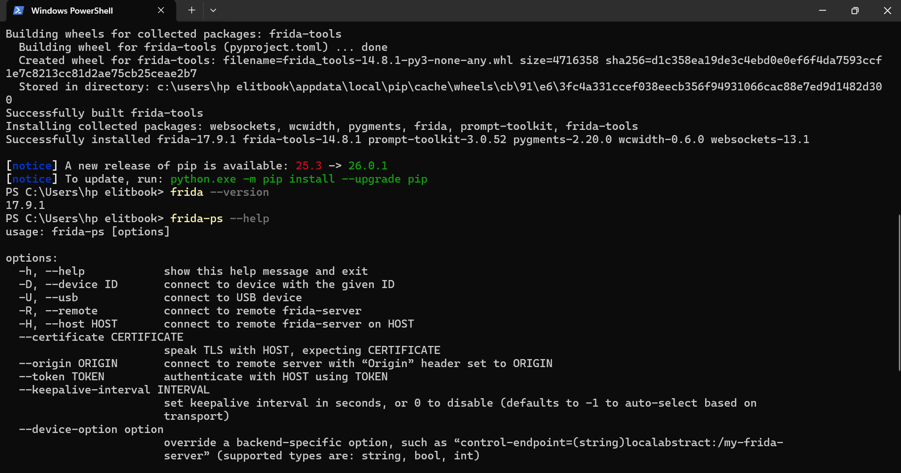
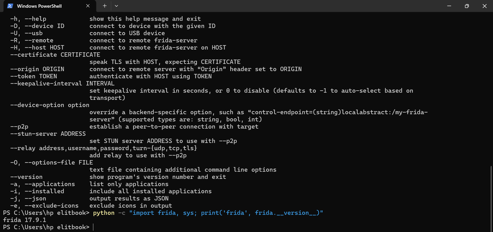
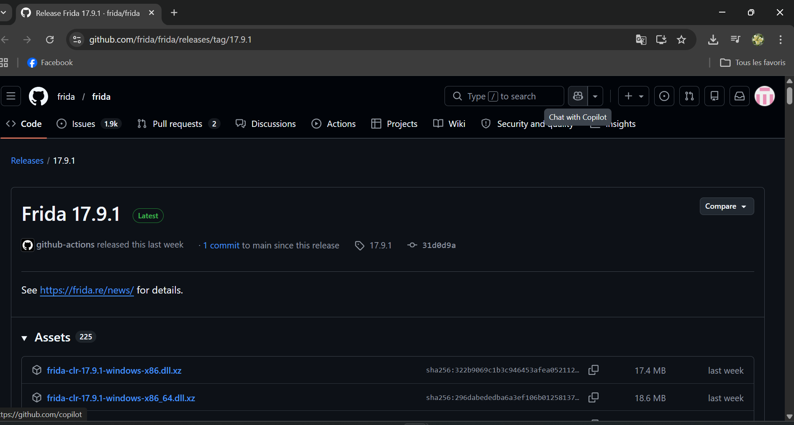
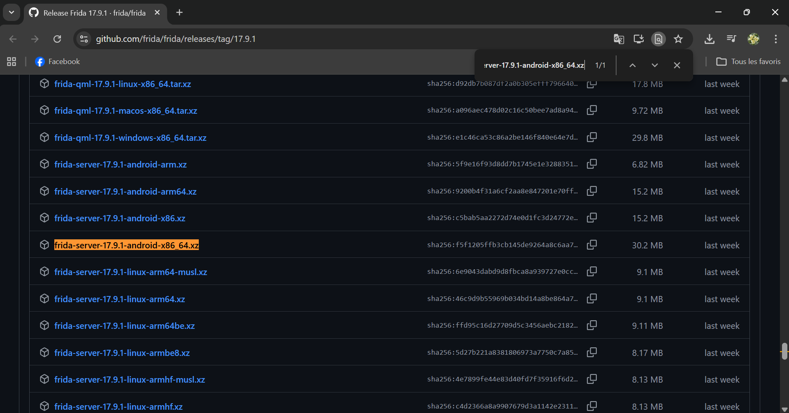
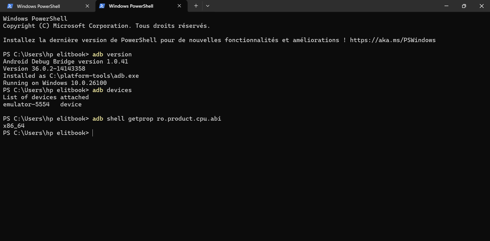
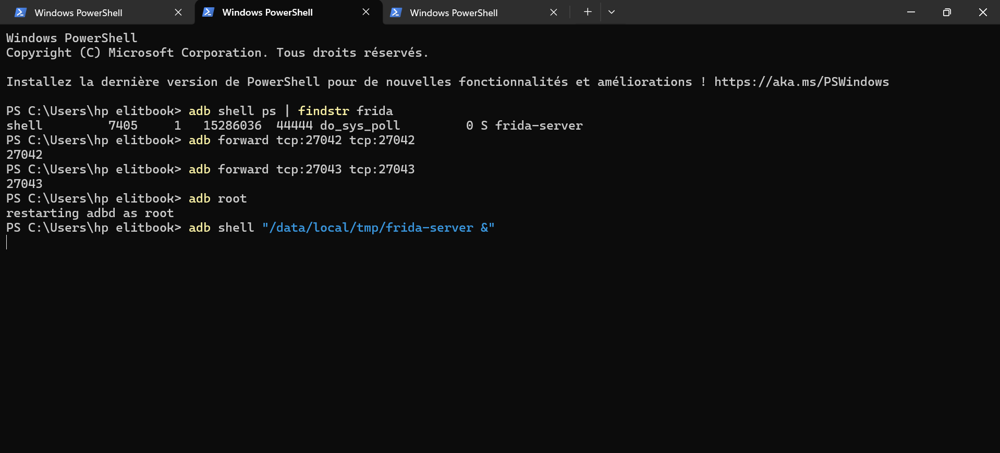
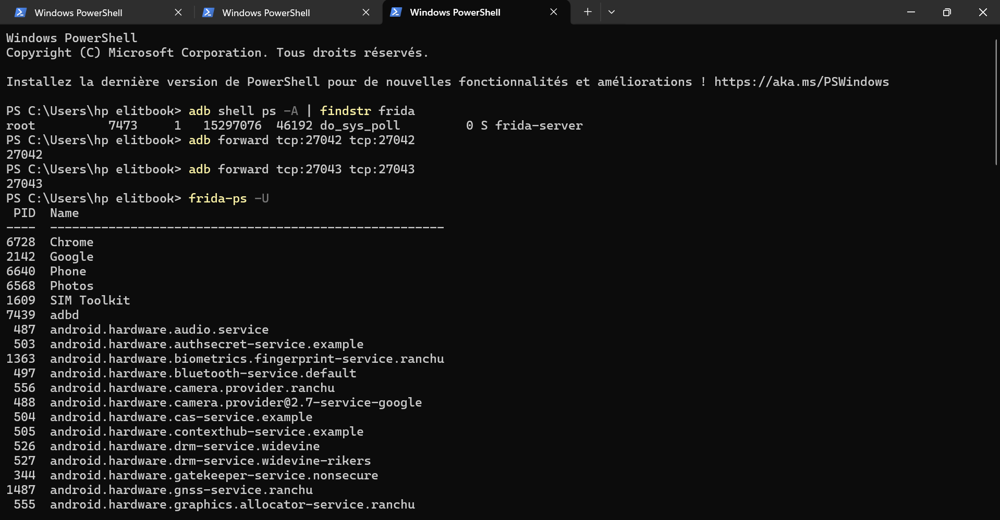
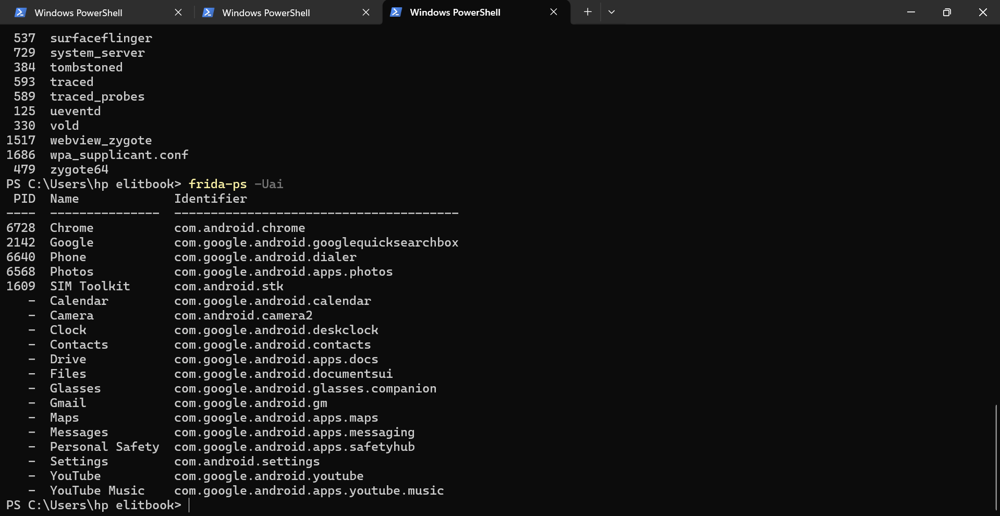
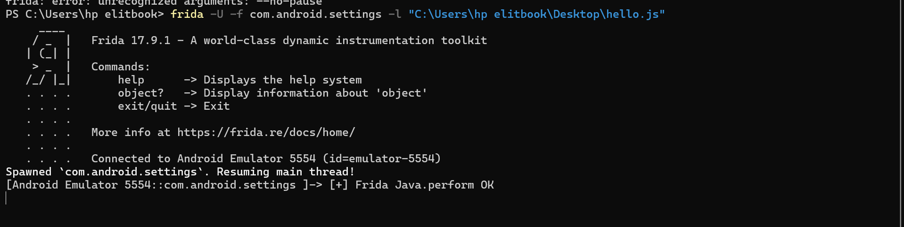

# 🔐 Lab Frida — Analyse dynamique d'une application Android

> **Environnement :** Windows 10 · Python 3.13.11 · Frida 17.9.1 · Émulateur Android (Pixel 6 Pro API 37.0 — emulator-5554)  
> **Application cible :** Android Settings (`com.android.settings`)

---

## 📋 Table des matières

- [Étape 1 — Installation du client Frida](#étape-1--installation-du-client-frida)
- [Étape 2 — Installation ADB et connexion émulateur](#étape-2--installation-adb-et-connexion-émulateur)
- [Étape 3 — Déploiement de frida-server sur l'émulateur](#étape-3--déploiement-de-frida-server-sur-lémulateur)
- [Étape 4 — Test de connexion](#étape-4--test-de-connexion)
- [Étape 5 — Injection minimale](#étape-5--injection-minimale)
- [Étape 7 — Hooks réseau et système de fichiers](#étape-7--hooks-réseau-et-système-de-fichiers)
- [Résultats obtenus](#résultats-obtenus)

---

## Étape 1 — Installation du client Frida

### Commandes exécutées

```powershell
python --version
pip --version
pip install --upgrade frida frida-tools
frida --version
frida-ps --help
python -c "import frida, sys; print('frida', frida.__version__)"
RésultatsComposantVersionPython3.13.11pip25.3frida17.9.1frida-tools14.8.1Captures d'écranInstallation de Frida 17.9.1 via pip.Confirmation de la version installée.Vérification des outils frida-tools.Étape 2 — Installation ADB et connexion émulateurCommandes exécutéesPowerShelladb version
adb devices
adb shell getprop ro.product.cpu.abi
Capture d'écranADB version 1.0.41 · Émulateur emulator-5554 connecté · Architecture x86_64.Étape 3 — Déploiement de frida-server sur l'émulateur3.1 Téléchargement et préparationFichier utilisé : frida-server-17.9.1-android-x86_64.xzPage de téléchargement officielle.Sélection du binaire x86_64 pour l'émulateur.3.2 Lancement sur l'appareilPowerShelladb root
adb forward tcp:27042 tcp:27042
adb shell "/data/local/tmp/frida-server &"
Passage en root et lancement du démon Frida.Étape 4 — Test de connexionCommandesPowerShellfrida-ps -U
frida-ps -Uai
Captures d'écranListe des processus en cours d'exécution.Identification du package cible : com.android.settings.Étape 5 — Injection minimaleScript hello.jsJavaScriptJava.perform(function () {
  console.log("[+] Frida Java.perform OK");
});
Succès de l'injection initiale dans l'application Settings.Étape 7 — Hooks réseau et système de fichiers7.1 Hook Réseau (libc connect)Interception des tentatives de connexion socket.Code source du hook réseau.Logs des appels connect interceptés.Interaction en temps réel entre le script et l'application.7.2 Hook Système de fichiers (libc open)Observation des fichiers ouverts par l'application (APK, SharedPreferences, Certificats).Code source du hook d'ouverture de fichiers.Liste des fichiers accédés par com.android.settings.Résultats obtenusÉtapeÉtatInstallation Frida✅Connexion ADB✅Frida-Server Android✅Injection Java✅Hook Réseau (libc)✅Hook Fichiers (libc)✅Observations de sécuritéL'application Settings accède à /apex/com.android.conscrypt/cacerts au démarrage (vérification SSL).Des connexions réseau sont établies via des sockets natifs dès le lancement.Lecture intensive des fichiers XML de préférences dans /data/user_de/0/com.android.settings/.🛠 Environnement techniqueMachine : HP EliteBookSystème : Windows 10Émulateur : Pixel 6 Pro (Android 14 / API 37)Outil : Frida 17.9.1
