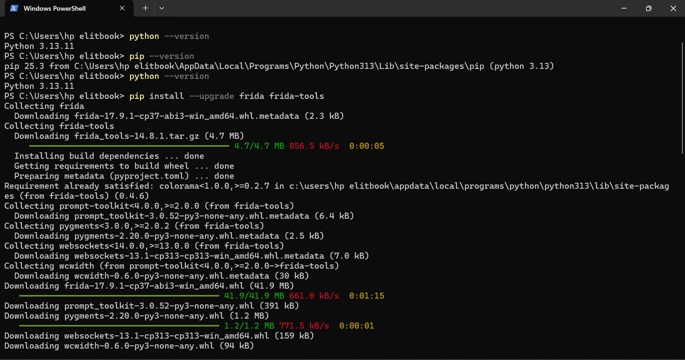
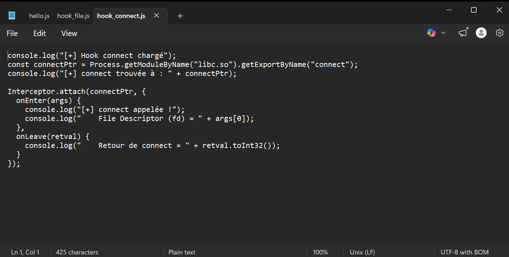
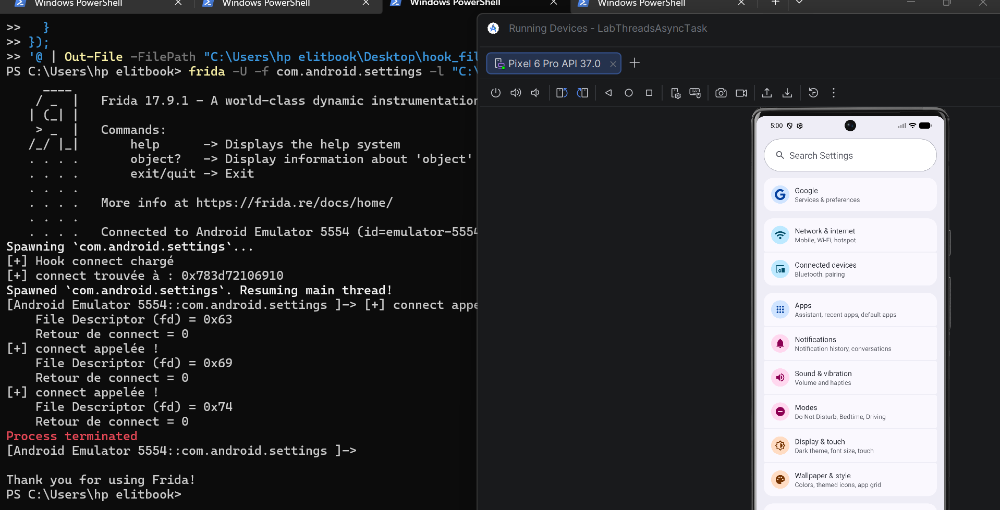
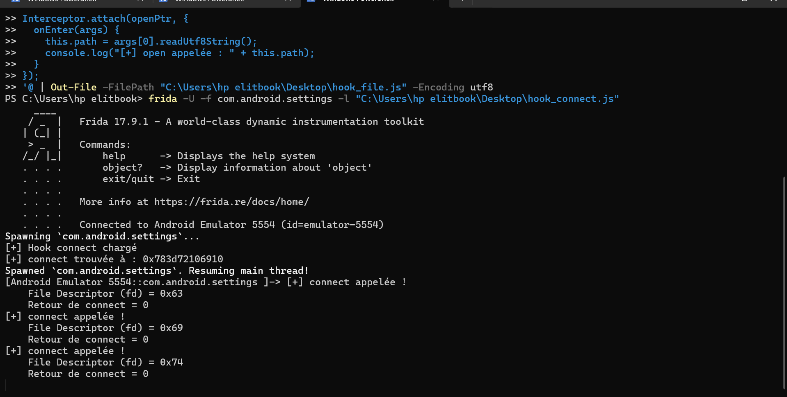
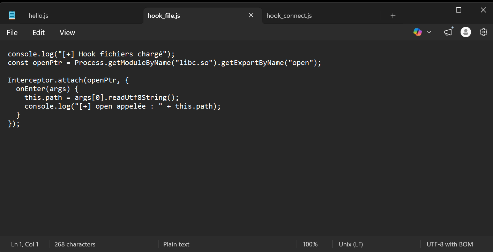
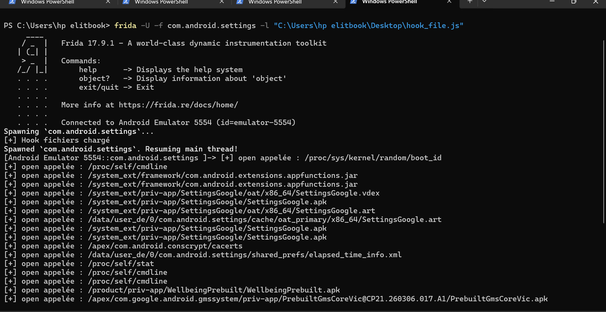

# 🔐 Lab Frida — Analyse dynamique d'une application Android

> **Environnement :** Windows 10 · Python 3.13.11 · Frida 17.9.1 · Émulateur Android (Pixel 6 Pro API 37.0 — emulator-5554)  
> **Application cible :** Android Settings (`com.android.settings`)

---

## 📋 Table des matières

- [Étape 1 — Installation du client Frida](#étape-1--installation-du-client-frida)
- [Étape 2 — Installation ADB et connexion émulateur](#étape-2--installation-adb-et-connexion-émulateur)
- [Étape 3 — Déploiement de frida-server sur l'émulateur](#étape-3--déploiement-de-frida-server-sur-lémulateur)
- [Étape 4 — Test de connexion](#étape-4--test-de-connexion)
- [Étape 5 — Injection minimale](#étape-5--injection-minimale)
- [Étape 7 — Hooks réseau et système de fichiers](#étape-7--hooks-réseau-et-système-de-fichiers)
- [Résultats obtenus](#résultats-obtenus)

---

## Étape 1 — Installation du client Frida

### Commandes exécutées

```powershell
python --version
pip --version
pip install --upgrade frida frida-tools
frida --version
frida-ps --help
python -c "import frida, sys; print('frida', frida.__version__)"
```

### Résultats

| Composant | Version |
|-----------|---------|
| Python | 3.13.11 |
| pip | 25.3 |
| frida | 17.9.1 |
| frida-tools | 14.8.1 |

### Captures d'écran


> Téléchargement et installation de frida 17.9.1 (41.9 MB) et frida-tools 14.8.1 via pip.


> `frida --version` → `17.9.1` · `frida-ps --help` opérationnel · `python -c "import frida"` → `frida 17.9.1`.


> Options complètes de `frida-ps` confirmées.

---

## Étape 2 — Installation ADB et connexion émulateur

### Commandes exécutées

```powershell
adb version
adb devices
adb shell getprop ro.product.cpu.abi
```

### Résultats

- ADB version : **1.0.41** (36.0.2-14143358) — installé dans `C:\platform-tools\`
- Émulateur détecté : `emulator-5554   device` ✅
- Architecture CPU : **x86_64**

### Capture d'écran


> ADB 1.0.41 installé · émulateur `emulator-5554` reconnu · architecture `x86_64` confirmée.

---

## Étape 3 — Déploiement de frida-server sur l'émulateur

### 3.1 Téléchargement

Fichier téléchargé depuis https://github.com/frida/frida/releases/tag/17.9.1 :

```
frida-server-17.9.1-android-x86_64.xz
```


> Page officielle Frida releases — version 17.9.1 Latest.


> Sélection du fichier `frida-server-17.9.1-android-x86_64.xz` (30.2 MB) correspondant à l'architecture x86_64.

### 3.2 Déploiement et lancement

```powershell
# Vérification frida-server actif
adb shell ps | findstr frida
# shell  7405  1  ...  frida-server

# Redirection des ports
adb forward tcp:27042 tcp:27042
adb forward tcp:27043 tcp:27043

# Passage en root
adb root
# restarting adbd as root

# Lancement frida-server
adb shell "/data/local/tmp/frida-server &"
```

### Capture d'écran


> `frida-server` tourne (PID 7405) · ports 27042/27043 redirigés · `adb root` → `restarting adbd as root`.

---

## Étape 4 — Test de connexion

### Commandes

```powershell
frida-ps -U
frida-ps -Uai
```

### Résultats

Liste complète des processus et applications de l'émulateur, notamment :
Chrome, Google, Phone, Photos, SIM Toolkit, Calendar, Settings, YouTube...

### Captures d'écran


> `frida-ps -U` liste les processus actifs : Chrome (6728), Google (2142), Phone (6640), Photos (6568)...


> `frida-ps -Uai` affiche les packages installés : `com.android.settings`, `com.google.android.calendar`, `com.android.chrome`...

---

## Étape 5 — Injection minimale

### Script hello.js

```javascript
Java.perform(function () {
  console.log("[+] Frida Java.perform OK");
});
```

### Commande

```powershell
frida -U -f com.android.settings -l "C:\Users\hp elitbook\Desktop\hello.js"
```

### Résultat

```
Spawned 'com.android.settings'. Resuming main thread!
[Android Emulator 5554::com.android.settings ]-> [+] Frida Java.perform OK
```

### Capture d'écran


> `[+] Frida Java.perform OK` confirmé · Frida injecte avec succès dans `com.android.settings`.

---

## Étape 7 — Hooks réseau et système de fichiers

### 7.1 Script hook_connect.js

```javascript
console.log("[+] Hook connect chargé");
const connectPtr = Process.getModuleByName("libc.so").getExportByName("connect");
console.log("[+] connect trouvée à : " + connectPtr);

Interceptor.attach(connectPtr, {
  onEnter(args) {
    console.log("[+] connect appelée !");
    console.log("    File Descriptor (fd) = " + args[0]);
  },
  onLeave(retval) {
    console.log("    Retour de connect = " + retval.toInt32());
  }
});
```

### Capture d'écran du script


> Script `hook_connect.js` — interception de la fonction `connect` de `libc.so`.

### Commande

```powershell
frida -U -f com.android.settings -l "C:\Users\hp elitbook\Desktop\hook_connect.js"
```

### Résultat observé

```
[+] Hook connect chargé
[+] connect trouvée à : 0x783d72106910
Spawned 'com.android.settings'. Resuming main thread!
[+] connect appelée !
    File Descriptor (fd) = 0x63
    Retour de connect = 0
[+] connect appelée !
    File Descriptor (fd) = 0x69
    Retour de connect = 0
[+] connect appelée !
    File Descriptor (fd) = 0x74
    Retour de connect = 0
```

### Captures d'écran


> Settings spawné · 3 connexions interceptées (fd=0x63, 0x69, 0x74) · toutes avec retour=0 (succès).


> Détail des appels `connect` interceptés au démarrage de `com.android.settings`.

---

### 7.2 Script hook_file.js

```javascript
console.log("[+] Hook fichiers chargé");
const openPtr = Process.getModuleByName("libc.so").getExportByName("open");

Interceptor.attach(openPtr, {
  onEnter(args) {
    this.path = args[0].readUtf8String();
    console.log("[+] open appelée : " + this.path);
  }
});
```

### Capture d'écran du script


> Script `hook_file.js` — interception de `open` pour observer les fichiers accédés.

### Commande

```powershell
frida -U -f com.android.settings -l "C:\Users\hp elitbook\Desktop\hook_file.js"
```

### Résultat observé (extrait)

```
[+] Hook fichiers chargé
[+] open appelée : /proc/sys/kernel/random/boot_id
[+] open appelée : /proc/self/cmdline
[+] open appelée : /system_ext/framework/com.android.extensions.appfunctions.jar
[+] open appelée : /system_ext/priv-app/SettingsGoogle/oat/x86_64/SettingsGoogle.vdex
[+] open appelée : /system_ext/priv-app/SettingsGoogle/SettingsGoogle.apk
[+] open appelée : /apex/com.android.conscrypt/cacerts
[+] open appelée : /data/user_de/0/com.android.settings/shared_prefs/elapsed_time_info.xml
[+] open appelée : /proc/self/stat
[+] open appelée : /product/priv-app/WellbeingPrebuilt/WellbeingPrebuilt.apk
```

### Capture d'écran


> Settings ouvre ses ressources au démarrage : APK, certificats (`cacerts`), préférences partagées (`shared_prefs`), ressources système.

---

## Résultats obtenus

### Tableau récapitulatif

| Étape | Commande / Script | Résultat observé |
|-------|-------------------|-----------------|
| 1 | `pip install frida frida-tools` | Frida 17.9.1 installé ✅ |
| 2 | `adb devices` | `emulator-5554 device` ✅ |
| 2 | `getprop ro.product.cpu.abi` | `x86_64` ✅ |
| 3 | Téléchargement GitHub | `frida-server-17.9.1-android-x86_64.xz` ✅ |
| 3 | `adb root` + lancement | frida-server actif PID 7405/7473 ✅ |
| 4 | `frida-ps -U` | Chrome, Google, Phone, Photos listés ✅ |
| 4 | `frida-ps -Uai` | Tous les packages affichés ✅ |
| 5 | `hello.js` sur `com.android.settings` | `[+] Frida Java.perform OK` ✅ |
| 7 | `hook_connect.js` | 3 connexions interceptées (fd=0x63/0x69/0x74) ✅ |
| 7 | `hook_file.js` | APK, certificats, shared_prefs ouverts ✅ |

### Observations de sécurité

- **Activité réseau native confirmée** : Settings établit 3 connexions TCP au démarrage — communication avec les services Google.
- **Accès aux certificats** : `/apex/com.android.conscrypt/cacerts` ouvert → vérification des certificats TLS au lancement.
- **Préférences locales** : `/data/user_de/0/com.android.settings/shared_prefs/elapsed_time_info.xml` → stockage local de données utilisateur.
- **Ressources système** : lecture de `SettingsGoogle.apk`, `.vdex`, `.art` → chargement dynamique de classes.
- **`Java.perform` fonctionnel** : instrumentation Java complète disponible dans `com.android.settings`.

---

## 🛠 Environnement technique

| Élément | Valeur |
|---------|--------|
| OS | Windows 10 (10.0.26100) |
| Machine | HP EliteBook |
| Python | 3.13.11 |
| pip | 25.3 |
| Frida client | 17.9.1 |
| frida-tools | 14.8.1 |
| ADB | 1.0.41 (36.0.2-14143358) |
| Émulateur | Pixel 6 Pro API 37.0 (Android 14) |
| Architecture | x86_64 |
| frida-server | 17.9.1-android-x86_64 |
| App cible | Android Settings (`com.android.settings`) |

---

## 📁 Scripts du lab

```
Desktop/
├── hello.js           # Test Java.perform → [+] Frida Java.perform OK
├── hook_connect.js    # Hook fonction connect (réseau)
└── hook_file.js       # Hook fonction open (accès fichiers)
```
